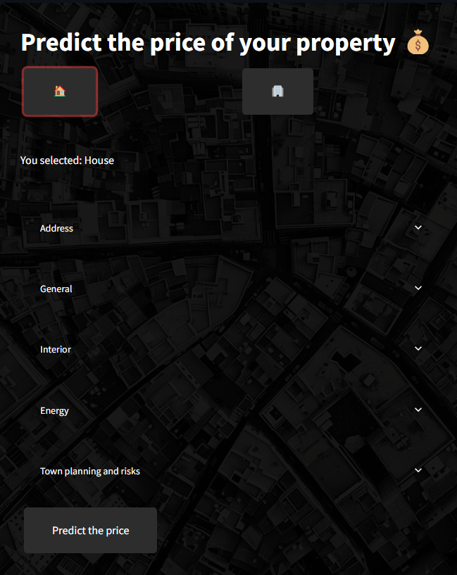

# IMMOWEB Machine Learning
[](https://www.python.org/)


 ## 📝 Description

 This repository contains the deployment files for "Immobilien Eliza", a Streamlit web application for real estate analysis and visualization. The application provides users with insights into real estate data, including property prices, trends, and visualizations.

 ## 📦 Repo structure

 ```bash
.
├── column_names
│   ├── column_names_APARTMENT.csv
│   └── column_names_HOUSE.csv
├── pics
│   ├── city_1.png
│   ├── city_2.png
│   ├── deployed-app_2.png
│   └── Screenshot_app_1.png
├── preprocess_and_models
│   ├── apartment
│   │   ├── trained_cat_imp_APARTMENT.pkl.gz
│   │   ├── trained_encoder_APARTMENT.pkl.gz
│   │   ├── trained_num_imp_APARTMENT.pkl.gz
│   │   └── trained_scaler_APARTMENT.pkl.gz
│   └── house
│       ├── trained_cat_imp_HOUSE.pkl.gz
│       ├── trained_encoder_HOUSE.pkl.gz
│       ├── trained_num_imp_HOUSE.pkl.gz
│       └── trained_scaler_HOUSE.pkl.gz
├── src
│   └── postcode_mapping.json
├── __init__.py
├── .gitignore
├── app.py
├── Dockerfile
├── predict_apartments.py
├── predict_houses.py
├── README.md
└── requirements.txt
 ```

 ## 🚀 Features
 
 - Prediction of prices for houses and apartments. 
 - User-friendly interface for easy navigation.
 - Accessible from any device with an internet connection.
 - Autofill functionality for postcode: When entering a postcode, the region, province, district, and city fields are automatically filled in.
 - Input validation: Prediction won't be executed if mandatory fields aren't filled in.

 ## ⚙️ Usage

 To use the Immobilien Eliza web application, simply navigate to [https://immo-eliza-deployment-ariana-bik.streamlit.app](https://immo-eliza-deployment-ariana-bik.streamlit.app) in your web browser. From there, you can interact with the various features and visualizations provided by the application.

 ## 🖼️ Screenshots

 

 ## 📑 Sources

 - [Immoweb](https://www.immoweb.be/en) - Real estate website from which data is scraped.

 ## ⏱️ Timeline

 This project took 5 days for completion.

 ## 📌 Personal Situation

 This project was done as part of the AI Bootcamp at BeCode.org.


https://immo-eliza-deployment-ariana-bik.streamlit.app